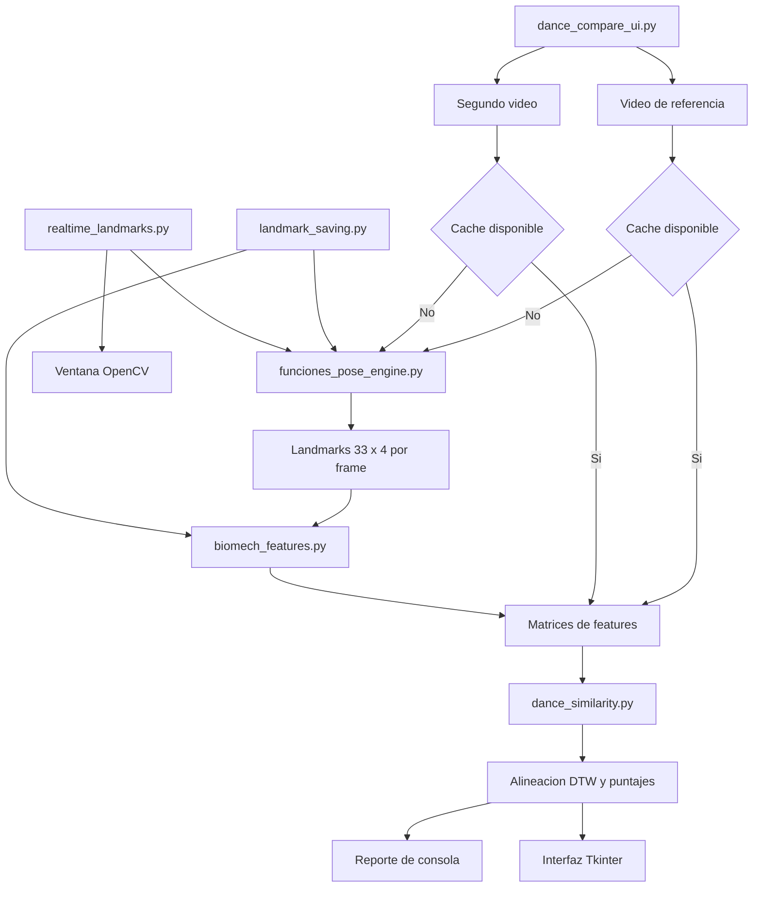

# Guia tecnica de Dance Match Lab

Este documento explica la arquitectura interna, el flujo de datos y el proposito de cada script Python. Esta pensado para desarrolladoras que necesiten corregir, extender o validar el prototipo.

Para instalacion y comandos de usuario consulta [README.md](README.md). Para estado, deuda tecnica y backlog consulta [HANDOFF.md](HANDOFF.md).

## Resumen de arquitectura

El pipeline principal transforma dos videos en secuencias numericas comparables:



Hay tres puntos de entrada para el usuario:

| Entrada | Proposito | Abre interfaz |
|---|---|---|
| `dance_compare_ui.py` | Comparar dos secuencias y producir puntajes | Si, salvo `--headless-report` |
| `landmark_saving.py` | Preprocesar y guardar landmarks/features | No |
| `realtime_landmarks.py` | Ver pose y angulos desde camara o video | Si, ventana OpenCV |

`test_env.py` es una comprobacion de instalacion, no un flujo de producto.

## Contratos de datos

Los modulos se conectan mediante estas estructuras:

| Dato | Forma o tipo | Contenido |
|---|---|---|
| Frame de OpenCV | `np.ndarray (alto, ancho, 3)` | Imagen BGR |
| Landmarks de un frame | `np.ndarray (33, 4)` | `[x, y, z, visibility]` de MediaPipe Pose |
| Secuencia de landmarks | `list[tuple[int, np.ndarray]]` | Pares `(frame_id, landmarks)` |
| Features de un frame | `dict[str, float]` | Angulos, posiciones, distancias, simetrias y variables temporales |
| Matriz de features | `np.ndarray (n_frames, n_features)` | Una fila por frame y una columna por feature |
| Nombres de features | `list[str]` | Orden exacto de las columnas de la matriz |
| Ruta DTW | `list[tuple[int, int]]` | Pares de indices alineados entre referencia y usuario |
| Mapa de reproduccion | `np.ndarray (frames_referencia,)` | Frame del usuario asociado a cada frame de referencia |

### Archivos persistidos

`output/landmarks/<nombre>_landmarks.npy` guarda la secuencia de pares `(frame_id, landmarks)` como un array de objetos.

`output/features/<nombre>_features.npz` contiene:

- `X`: matriz `float32` de features.
- `feature_names`: nombres de columnas.
- `frame_ids`: identificadores originales de frame.

La relacion entre una matriz y sus nombres de columna es obligatoria. No se debe reordenar `X` sin reordenar tambien `feature_names`.

## `app/src/test_env.py`

### Proposito

Es una prueba rapida de que el entorno puede importar las dependencias criticas y crear un modelo MediaPipe Pose.

### Funcionamiento

1. Importa OpenCV, MediaPipe, NumPy, SciPy y Pillow.
2. Imprime la version de cada dependencia.
3. Construye `mp.solutions.pose.Pose()`.
4. Confirma que el modelo fue cargado.

El script se ejecuta directamente al importarlo porque no define `main()`. No debe usarse como libreria.

### Cuando modificarlo

Agrega aqui una comprobacion cuando una nueva dependencia sea indispensable para arrancar el proyecto.

## `app/src/realtime_landmarks.py`

### Proposito

Proporciona una CLI pequena para probar la calidad de deteccion antes de procesar o comparar un video.

### Argumentos

- `--camera N`: abre el indice de camara indicado; el valor implicito es `0`.
- `--video RUTA`: abre un archivo local.
- `--mirror` / `--no-mirror`: controla el reflejo horizontal.

Camara y video son mutuamente excluyentes. Una camara se refleja por defecto para comportarse como un espejo; un archivo no.

### Flujo interno

1. `parse_args()` valida la fuente.
2. `main()` resuelve rutas relativas desde la raiz del proyecto.
3. Se crea `cv2.VideoCapture`.
4. El control pasa a `visualize_pose_engine_realtime()`.
5. La ventana termina al presionar `Q` o al acabarse el video.

Este script no guarda datos ni calcula similitud.

## `app/src/landmark_saving.py`

### Proposito

Preprocesa uno o varios videos para evitar repetir la parte costosa de MediaPipe y del calculo biomecanico.

### Funciones

- `parse_args()`: recibe cero o mas rutas y un `--output-dir` opcional.
- `resolve_path()`: convierte rutas relativas en rutas desde la raiz del proyecto.
- `discover_videos()`: usa las rutas recibidas o descubre `.mp4`, `.avi`, `.mov` y `.mkv` directamente dentro de `videos/`.
- `process_video()`: abre un video, extrae landmarks, calcula features y guarda ambos resultados.
- `main()`: recorre los videos, informa resultados y continua aunque un archivo falle.

### Flujo por video

```text
VideoCapture
  -> vector_pose_engine(cap)
  -> [(frame_id, landmarks 33x4), ...]
  -> extract_biomechanical_features(...)
  -> biomech_rows_to_matrix(...)
  -> .npy + .npz
```

El `VideoCapture` se libera en un bloque `finally`. Si algun video falla, el script procesa los restantes y termina con codigo de error `1` despues de imprimir un resumen.

## `app/src/funciones_pose_engine.py`

### Proposito

Es la capa de vision y geometria de pose. Encapsula MediaPipe, conversion de landmarks, calculo/dibujo de angulos, suavizado y visualizacion.

### Configuracion actual

- Umbral de visibilidad: `0.60`.
- MediaPipe `model_complexity=1`.
- Confianza minima de deteccion: `0.5`.
- Confianza minima de tracking: `0.7`.
- Suavizado Savitzky-Golay: ventana deseada `11`, polinomio `2`.

Si SciPy no esta disponible, el modulo conserva una ruta alternativa de suavizado basada en media movil.

### Conversores y validacion

- `landmarks_mp_to_array()`: convierte los 33 objetos de MediaPipe a `float32 (33, 4)`.
- `landmark_tuple_a_pixel()`: transforma coordenadas normalizadas en pixeles.
- `landmark_visible()` y `trio_visible()`: validan coordenadas finitas y visibilidad antes de calcular/dibujar.

### Angulos y suavizado

- `calcular_angulo()`: calcula un angulo 2D en el punto central de tres puntos.
- `calcular_angulos_frame()`: aplica `ANGLE_DEFS` a hombros, codos, munecas, caderas, rodillas y tobillos.
- `interpolar_nans_1d()`: interpola huecos cuando hay suficientes valores validos.
- `moving_average_1d()`: suavizado de respaldo.
- `suavizar_serie_angular()`: usa Savitzky-Golay cuando la longitud y SciPy lo permiten.
- `suavizar_angulos_por_frame()`: suaviza cada serie articular y reconstruye el resultado por frame.

### Dibujo

- `dibujar_arco()`: representa graficamente un angulo.
- `dibujar_angulo_en_articulacion()`: dibuja arco, puntos y etiqueta para una articulacion.
- `dibujar_esqueleto_manual()`: dibuja conexiones y landmarks visibles sin depender del renderer de MediaPipe.

### Extractores

- `vector_pose_engine(cap)`: salida principal para el resto del proyecto. Devuelve una entrada por cada frame, incluso si no hay pose; en ese caso usa una matriz `33 x 4` llena de `NaN`.
- `angles_pose_engine(cap)`: devuelve solamente angulos suavizados por frame.
- `visualize_pose_engine(cap)`: carga un video completo en memoria, calcula angulos suavizados y luego lo reproduce. Es util para experimentacion, pero no para videos largos.
- `visualize_pose_engine_realtime(cap, mirror=True)`: procesa y dibuja frame a frame sin guardar la secuencia completa.

`vector_pose_engine()` refleja horizontalmente cada frame antes de MediaPipe. La interfaz principal tambien refleja el frame mostrado, por lo que landmarks y visualizacion mantienen la misma orientacion. Si se cambia este comportamiento debe cambiarse de forma coherente en extraccion y reproduccion.

## `app/src/biomech_features.py`

### Proposito

Convierte landmarks en una representacion numerica mas estable para comparar baile. Este modulo no abre videos ni conoce la interfaz; solo opera con arrays y diccionarios.

### Configuracion y definiciones

- `LM`: indices de MediaPipe usados y sus nombres.
- `ANGLE_DEFS`: trios que definen articulaciones.
- `SEGMENTS`: pares para longitud y orientacion de segmentos.
- `DISTANCE_PAIRS`: distancias corporales relevantes.
- `MOTION_LANDMARKS`: puntos que participan en velocidad, aceleracion y energia.

### Normalizacion corporal

`_body_center_and_scale()` intenta centrar la pose en el punto medio de las caderas. La escala es la mediana de las medidas validas entre ancho de hombros, ancho de caderas y longitud del torso.

`_normalized_landmarks()` aplica:

```text
landmark_normalizado = (landmark - centro_corporal) / escala_corporal
```

Esto reduce el efecto de la posicion de la persona y de su distancia a la camara. Si no hay centro o escala validos, devuelve `NaN`.

### Features estaticas por frame

`extract_frame_biomechanical_features()` recibe `(frame_id, landmarks 33x4)` y produce un diccionario que incluye:

- Visibilidad y proporcion de landmarks detectados.
- Coordenadas `x/y/z` normalizadas.
- Bounding box y compactacion de pose.
- Angulos articulares.
- Longitudes y orientaciones de segmentos.
- Distancias entre articulaciones.
- Inclinacion y longitud del tronco.
- Relacion de cabeza y tronco.
- Alcance y extension de brazos/piernas.
- Alturas relativas.
- Diferencias de simetria izquierda/derecha.

Los datos no confiables se conservan como `NaN`; no se convierten prematuramente en cero.

### Features temporales

`_add_temporal_features()` usa el FPS para calcular el intervalo `dt = 1/fps`. Interpola temporalmente valores faltantes antes de aplicar `np.gradient`, pero vuelve a marcar como `NaN` las posiciones originalmente invalidas.

Agrega:

- Velocidad y aceleracion de coordenadas, angulos, longitudes y distancias.
- Rapidez y aceleracion vectorial por landmark.
- Energia de movimiento total, superior, inferior, izquierda y derecha.
- Diferencia de energia entre lados.
- Energia angular media.

### API principal

- `extract_biomechanical_features()`: aplica el extractor por frame y opcionalmente las derivadas temporales.
- `biomech_rows_to_matrix()`: crea `X`, `feature_names` y `frame_ids`. Los nombres se ordenan alfabeticamente para obtener un orden reproducible.

## `app/src/dance_similarity.py`

### Proposito

Carga o construye secuencias comparables, selecciona features relevantes, normaliza ambas secuencias, ejecuta DTW y genera los resultados consumidos por la CLI y la interfaz.

### Modelos de datos

| Clase | Contenido |
|---|---|
| `DanceSequence` | Ruta, FPS, numero de frames, landmarks, matriz y nombres de features |
| `DtwAlignment` | Distancia promedio, puntaje y ruta DTW |
| `IntervalScore` | Tiempo inicial/final, puntaje, distancia, desfase, amplitud y feedback |
| `DanceComparison` | Resultado global, grupos, intervalos, ruta DTW y mapa de frames |

Algunas variables internas conservan el nombre historico `benchmark`; funcionalmente representan la secuencia de referencia elegida por el usuario.

### Carga y construccion de secuencias

- `get_video_info()`: obtiene FPS y cantidad de frames; usa `30 FPS` si el video no reporta un valor valido.
- `load_landmarks()` / `load_landmarks_csv()`: cargan `.npy` o CSV de 99/100/132/133 columnas.
- `save_landmarks()`: persiste la secuencia como `.npy`.
- `extract_landmarks_from_video()`: delega en `vector_pose_engine()`.
- `load_feature_matrix()` / `save_feature_matrix()`: manejan `.npz`.
- `sequence_from_video()`: decide si cargar cache o extraer/calcular y devuelve un `DanceSequence` completo.

Si `cache_missing=True`, `sequence_from_video()` guarda landmarks y features faltantes en las rutas recibidas.

### Seleccion y pesos de features

`dance_feature_weight()` asigna peso segun el nombre. Actualmente:

- Excluye `frame_id`, flags `vis_*`, aceleraciones `*_acc` y escala corporal cruda.
- Da mayor peso a angulos articulares principales.
- Usa coordenadas normalizadas de landmarks clave.
- Incluye orientaciones, longitudes, distancias, velocidades, energia, simetria y postura.
- Reduce el peso de profundidad `z`, visibilidad global y algunas variables ruidosas.

`_select_common_feature_matrix()` conserva solo features presentes en ambas secuencias y aplica esos pesos.

### Normalizacion robusta

`_robust_normalize_pair()` concatena temporalmente ambas matrices y:

1. Descarta columnas con menos de `15%` de valores finitos.
2. Calcula mediana e IQR (`q75 - q25`).
3. Usa desviacion estandar si el IQR no sirve.
4. Sustituye valores no finitos por cero despues de normalizar.
5. Limita los valores al rango `[-6, 6]`.

La normalizacion conjunta hace que referencia y usuario compartan la misma escala numerica.

### Reduccion temporal y DTW

`downsample_matrix()` reduce cada secuencia al `target_fps` solicitado, cuyo valor predeterminado es `12`.

`dtw_align()` implementa Dynamic Time Warping mediante programacion dinamica. El costo local es distancia L1 ponderada:

```text
costo(a, b) = sum(abs(a - b) * pesos) / sum(pesos)
```

Se permiten movimientos diagonal, vertical y horizontal. `_backtrack_path()` reconstruye la alineacion desde el ultimo par hasta el primero.

La complejidad temporal es `O(n*m)` y la matriz de direcciones usa memoria `O(n*m)`. Reducir a `target_fps` evita que videos largos crezcan cuadraticamente con su FPS original, pero la duracion total sigue siendo importante.

### Conversion de distancia a puntaje

`score_from_distance()` aplica:

```text
score = 100 * exp(-distance / 1.55)
```

El resultado se limita a `[0, 100]`. Modificar `1.55` cambia la sensibilidad global y requiere recalibrar los umbrales de feedback.

### Resultados derivados

- `score_groups_from_path()`: agrupa columnas por tokens para brazos, piernas, torso y movimiento.
- `score_intervals_from_path()`: divide el tiempo de referencia en segmentos, con `10 s` por defecto.
- `segment_amplitude_delta()`: compara dispersion de movimiento entre ambas secuencias.
- `interval_feedback()`: combina puntaje, desfase y amplitud para producir etiqueta y detalle.
- `build_benchmark_to_user_frame_map()`: interpola la ruta DTW para asociar cada frame de referencia con un frame del usuario.

Umbrales actuales de feedback:

- `score >= 86` y sin desfase: `Excelente`.
- `score >= 72`: `Bien` o `Desfasado` segun tiempo/amplitud.
- `score >= 58` con desfase: `Desfasado`.
- Resto: `Movimiento diferente`.

## `app/src/dance_compare_ui.py`

### Proposito

Es el orquestador principal. Interpreta argumentos, resuelve videos y caches, construye las dos `DanceSequence`, ejecuta la comparacion y presenta el resultado.

### Argumentos importantes

- `--reference-video`: video obligatorio que define la secuencia de referencia.
- `--user-video`: segundo video.
- `--reference-landmarks` / `--reference-features`: caches explicitos de referencia.
- `--user-landmarks` / `--user-features`: caches explicitos del segundo video.
- `--cache-missing`: guarda automaticamente lo que tenga que calcular.
- `--target-fps`: frecuencia usada por DTW.
- `--interval-seconds`: tamano temporal de los segmentos.
- `--headless-report`: imprime y termina sin Tkinter.
- `--demo`: compara la referencia consigo misma.

### Resolucion automatica de cache

`default_cache_path()` usa el nombre base del video:

```text
mi_baile.mp4
  -> output/landmarks/mi_baile_landmarks.npy
  -> output/features/mi_baile_features.npz
```

Si existe un `.csv` de landmarks con ese nombre, tambien puede cargarse. Dos videos distintos con el mismo nombre base pueden colisionar; esta es una deuda conocida.

### Flujo de `main()`

1. Resuelve y carga/procesa la referencia.
2. Carga/procesa el segundo video o construye el modo demo.
3. Llama `compare_dance_sequences()`.
4. Imprime resumen de features y puntajes.
5. Termina si se solicito modo headless.
6. En otro caso llama `run_interface()`.

### Interfaz Tkinter

`run_interface()` mantiene dos `VideoCapture`. El frame de referencia dirige el reloj de reproduccion. Para cada frame:

1. Lee y prepara el frame de referencia.
2. Usa `bench_to_user_frame` para buscar el frame alineado del usuario.
3. Refleja y redimensiona ambos paneles.
4. Obtiene landmarks precalculados y dibuja esqueleto/angulos.
5. Compone un canvas BGR con videos, barras, puntaje e intervalos.
6. Convierte el canvas a una imagen Pillow/Tkinter.
7. Programa el siguiente ciclo mediante `root.after()`.

Si no existe comparacion, `mapped_user_frame()` sincroniza aproximadamente por tiempo usando la relacion entre FPS.

La busqueda aleatoria del frame de usuario mediante `VideoCapture.set()` puede ser costosa con ciertos codecs. Una mejora futura seria decodificar secuencialmente o preparar un video alineado.

### Funciones visuales

- `prepare_video_frame()`: refleja, redimensiona y aplica overlay.
- `landmarks_at()`: obtiene los landmarks correspondientes a un frame.
- `draw_skeleton()`, `draw_joint_angle()` y `draw_pose_overlay()`: dibujan pose.
- `compose_canvas()`: ensambla ambos paneles y el dashboard.
- `draw_score_dashboard()`: presenta puntaje global y grupos.
- `draw_interval_strip()` / `draw_active_interval()`: representan resultados temporales.
- `color_for_score()`: traduce puntaje a color.

## Dependencias entre scripts

```text
dance_compare_ui.py
  -> dance_similarity.py
       -> biomech_features.py
       -> funciones_pose_engine.py (import diferido para extraccion)

landmark_saving.py
  -> funciones_pose_engine.py
  -> biomech_features.py

realtime_landmarks.py
  -> funciones_pose_engine.py

test_env.py
  -> dependencias externas
```

Los imports entre scripts funcionan porque se ejecutan desde `app/src`. Todavia no existe un paquete Python con imports absolutos; si se reorganiza la estructura, estos imports deben migrarse juntos.

## Como extender el sistema

### Agregar una feature biomecanica

1. Calculala en `extract_frame_biomechanical_features()` o `_add_temporal_features()`.
2. Confirma que `biomech_rows_to_matrix()` la incluya.
3. Asigna un peso en `dance_feature_weight()` si debe afectar el puntaje.
4. Agrega un test con datos sinteticos y casos `NaN`.
5. Reprocesa los videos; los `.npz` antiguos no contienen la nueva columna.

### Cambiar el puntaje

Revisa conjuntamente:

- `dance_feature_weight()` para pesos.
- `_robust_normalize_pair()` para escala y filtrado.
- `weighted_row_distance()` para metrica local.
- `score_from_distance()` para sensibilidad.
- `interval_feedback()` para etiquetas.

Cambiar solo uno puede alterar la interpretacion de todos los puntajes existentes.

### Agregar exportacion JSON o CSV

`DanceComparison` ya concentra el resultado. El punto natural de integracion es despues de `print_report()` en `dance_compare_ui.py`. Conviene serializar tambien parametros como FPS objetivo, intervalo, nombres de videos y version del algoritmo.

### Cambiar MediaPipe o el modelo de pose

Mantiene el contrato `(33, 4)` o adapta de forma coordinada:

- Los indices `LM`, `ANGLE_DEFS`, `SEGMENTS` y `DISTANCE_PAIRS`.
- Las conexiones y angulos de la interfaz.
- Los cargadores de `.npy`/CSV.
- Las pruebas y caches existentes.

## Validacion tecnica minima

Despues de cambios en codigo:

```powershell
uv lock --check
uv sync --locked
uv pip check
uv run --locked python -m compileall -q app
uv run --locked python app\src\test_env.py
uv run --locked python app\src\dance_compare_ui.py --help
uv run --locked python app\src\landmark_saving.py --help
uv run --locked python app\src\realtime_landmarks.py --help
```

Los cambios en extraccion, features, DTW o UI tambien deben probarse con dos videos cortos. La ausencia actual de una suite automatizada significa que esta validacion manual sigue siendo necesaria.
